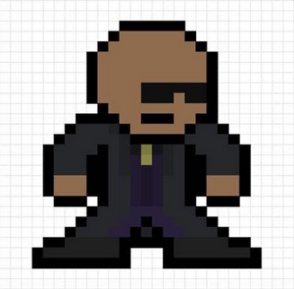
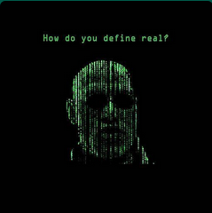
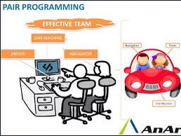
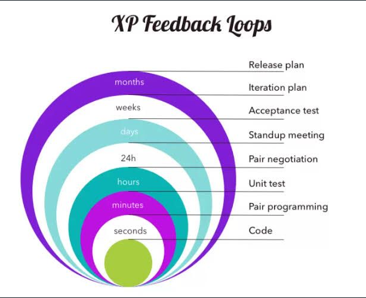

# OrfeoGPT

## O que é OrfeoGPT?

OrfeoGPT é um modelo de linguagem baseado no Lama, projetado para ser um Chatbot que auxilia trabalhadores em suas atividades diárias. Ele foi desenvolvido para ajudar a comunidade a resolver problemas, fornecendo respostas e soluções baseadas em uma extensa base de conhecimento.

## Tipos de perguntas que o OrfeoGPT pode responder:

- **Documentação**: "Me ajude a criar uma documentação."
- **Atas de Reunião**: "Me ajude a criar uma ata para a reunião."
- **Problemas de Integração**: "Me ajude a entender esse problema de comunicação entre 2 Apis: <api_1>, <api_2>."
- **Comunidade**: "Faça uma pergunta para a comunidade."

## Propósito:

OrfeoGPT foi criado com o objetivo de ser um auxiliar Chatbot. Utilizando sua base de conhecimento, ele ajuda membros da comunidade a encontrar soluções para seus problemas. Para mais informações sobre a base de conhecimento, consulte [aqui](https://crfm.stanford.edu/2023/03/13/alpaca.html).

## Como funciona:

1. **Adquira uma API Key**: Primeiro, você precisa de uma chave de API para acessar o OrfeoGPT.
2. **Forneça a URL da sua base de conhecimento**: O OrfeoGPT suporta várias plataformas, incluindo wiki, confluence, sharepoint e wordpress.
3. **Aguarde a Indexação**: Depois de fornecer a URL, o OrfeoGPT indexará o conteúdo para fornecer respostas mais precisas.
4. **Faça sua primeira pergunta**: Com tudo configurado, você está pronto para começar a fazer perguntas!

## Valores

* XP Programing  

## Pacotes de Humor

## Plugins disponíveis:

- **WebUrl Read**: Permite ao OrfeoGPT ler e interpretar informações de URLs.
- **Wiki**: Integração com plataformas wiki para buscar informações.
- **Chess**: Um divertido plugin para jogar xadrez.
- **Make a Diagram**: Ajuda a criar diagramas baseados em informações fornecidas.
- **Suport Question**: Se você estiver enfrentando um problema que o OrfeoGPT não pode resolver, use este plugin para postar uma pergunta em nossa versão do "stack overflow".

---